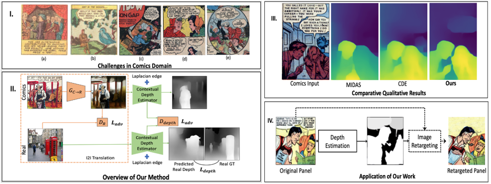

# Estimating Image Depth in the Comics Domain
Deblina Bhattacharjee, Martin Everaert, Mathieu Salzmann, Sabine Süsstrunk

WACV 2022 
Paper: https://arxiv.org/abs/2110.03575

https://ivrl.github.io/ComicsDepth/


1. Install pytorch,torchvision
2. Install apex
```
conda install -c conda-forge nvidia-apex
```
## Dataset
### Get the training datasets for Comics domain
DCM dataset
<!---


--->
```

Follow the instructions at [https://git.univ-lr.fr/crigau02/dcm_dataset/tree/master](https://git.univ-lr.fr/crigau02/dcm_dataset/tree/master) to get the images and annotations and place the downloaded folder *dcm_dataset.git* to *REPO_NAME/data*.
```
 eBDtheque dataset

<!---

--->
```
Follow the instructions at [http://ebdtheque.univ-lr.fr/registration/](http://ebdtheque.univ-lr.fr/registration/) to get the images and annotations and place the downloaded and uzipped folder *eBDtheque_database_v3* to *REPO_NAME/data*.
```
Manga109 dataset (optional)

<!---

--->
```
Follow the instructions at [http://www.manga109.org/en/download.html](http://www.manga109.org/en/download.html) to get the images and annotations and place the downloaded and uzipped folder *Manga109_released_2020_09_26* to *REPO_NAME/data*.
 ```

### Get the data for the Natural domain
 COCO 2017 dataset

<!---

--->
```
Download the *2017 Val images [5K/1GB]* folder at [https://cocodataset.org/#download](https://cocodataset.org/#download), unzip it, rename it to *coco_val2017* and place it to *REPO_NAME/data*.
```
### Preparing the datasets
 Generating cropped images from the DCM dataset

In the DCM dataset, one image corresponds to one page. In order to train the models, we should have one image per frame. To generate those cropped images in the *REPO_NAME/data/dcm_cropped* folder, use script:
```
python datasets_preparation.py --crop_frames
```

Generating comics text areas mask from the eBDtheque dataset
 
We use the eBDtheque dataset to detect the text areas in the comics images and mask them to remove text-based artefacts in the depth predictions.
To do this, split the eBDtheque dataset into train/val/test and run the script:
```
python datasets_preparation.py --generate_text_masks
```


### Generating depth ordering for evaluation

*This step requires a lot of manual annotation work and the benchmark will be updated and extended in future to contain more number of images. Please contact the authors for the newest version of the annotated benchmark. Also, if you want to contribute to this benchmark please contact the authors. *
Those ground-truth depth ordering must be place under *REPO_NAME/data/dcm_cropped/depth*. 


### Generating pseudo ground-truth depth of real images

In order to train our models, we want to have the depth of real-world images, which we achieve using [MiDaS](https://github.com/intel-isl/MiDaS). We do this once, instead of doing it at run-time. Those ground-truth depth of natural images can be placed under *REPO_NAME/data/coco_val2017_depth*. To generate them, we use the script:
```
python datasets_preparation.py --coco17_depth
```

  
## Training the models

### Comics text area detector
 We train a Unet on the eBDtheque dataset as it contains comics text annotations. We use the following script:
```
python comics2textareas.py --train
```
Few tricks that can be used:
We select the epoch with the highest validation IoU at threshold 0.5, using the following script:
```
python comics2textareas.py --select_epoch
```
To optimize the threshold, we use the followinf script:
```
python comics2textareas.py --optimize_threshold
```

### Visualise the results 
To visualise the text detection results trained on eBDtheque and tested on both eBDtheque test as weell as DCM we use the following scripts:
```
python comics2textareas.py --visualize_ebdtheque_val
python comics2textareas.py --visualize_dcm
```


### Generate comics without text areas
It is important to reemove the text-based artefacts in the depth prediction of comics, for which we eventually run our depth predictor on the comics images without text areas. Therefore, to generate the comics images without the text areas we run the following script: (Note that it requires the step above with a trained Unet)
```
python comics2textareas.py --generate_dcm_without_text_areas
```


### Generating translated images
We translate the images from the comics domain to the real domain and vice-versa by using an off-the-shelf state-of-the-art unsupervised image to image translator. To do so, we run the following script:

```
python translation.py without_text --train
python translation.py without_text --visualize_val
```


### Training the Depth estimator on the translated images
We train the Contextual Depth Estimator [CDE](https://github.com/miraiaroha/ACAN).   
```
python depth_estimator.py add_text_ignoretext --train --lr 1e-6
```


### Evaluating the models

 Generate depth images

```
 python translation.py without_text --generate_depth_images
 python translation.py without_text --visualize_depth_images
```

Quantitative evaluations

```
 python evaluation.py depth_estimator without_text


```
All models are available at https://drive.google.com/drive/folders/1df-jlouewbr2wLAQtlWzL4Hf5pxT2hHz?usp=sharing

##  Citation

If you find the code, data, or the models useful, please cite this paper:
```
     @misc{bhattacharjee2021estimating,
      title={Estimating Image Depth in the Comics Domain}, 
      author={Deblina Bhattacharjee and Martin Everaert and Mathieu Salzmann and Sabine Süsstrunk},
      year={2021},
      eprint={2110.03575},
      archivePrefix={arXiv},
      primaryClass={cs.CV}
     }
```
## License 
``` 
 [Creative Commons Attribution Non-commercial No Derivatives](http://creativecommons.org/licenses/by-nc-nd/3.0/)
```
